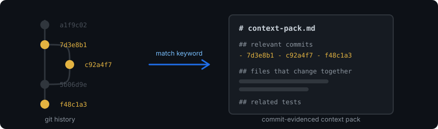

# Repo Chronicle

[](https://github.com/richardkuo2002/repo-chronicle/actions/workflows/ci.yml)
[](https://pypi.org/project/repo-chronicle/)
[](LICENSE)

> Local-first Git history context packs for understanding a repository before changing it.

[English](README.md) | [繁體中文](README.zh-TW.md)



## See it in action

No install needed to look — this is real output from
`repo-chronicle explain report` against the fixture repo in
[`examples/`](examples/walkthrough.md), not a mockup:

```markdown
# Context Pack: report

Generated:2026-09-12 20:28 | Repo: `/tmp/.../repo-chronicle-fixture-zcy1o09t` | Matched commits:4

## Evolution (chronological)

### 2024-04-01 `e4900b7e08` — Add --json output, preserve default text output and exit codes

Files touched:
- `report.py` (+18/-5)

### 2024-03-01 `1521a1e2da` — Avoid third-party runtime dependency for portability

Files touched:
- `report.py` (+5/-4)

### 2024-02-01 `787d4bcf11` — Send diagnostics to stderr, keep stdout automation-safe

Files touched:
- `report.py` (+9/-1)

### 2024-01-01 `7510ef4bd1` — Add text report command

Files touched:
- `report.py` (+14/-0)

---

## Likely Affected Files (by matched-commit frequency)

| File | Occurrences | Sample commit |
|---|---|---|
| `report.py` | 4 | `e4900b7e08` |

## Suggested Tests to Run

- ⚠ no matching test file found for `report.py` — verify manually

## Notes

This report is rule-based, not semantic analysis. Verify against the commit hashes shown.
```

Every line above traces to a real commit SHA in a real (fixture) repo — see
[`examples/walkthrough.md`](examples/walkthrough.md) for the full walkthrough
and what each section means.

## Why it exists

A coding assistant or a new contributor can read the current files in a repo,
but not the decisions behind them. Why does this function work the way it
does? What was tried and reverted? Which files tend to change together? Raw
`git log` has the answer somewhere in it, but it's too broad and unstructured
to hand to a focused change — you end up either skipping the history or
reading commits by hand.

## What Repo Chronicle produces

Run one command against a keyword, and Repo Chronicle scans local commit
history, picks out the commits that actually mention it (in the message or
in a changed file's path), and writes a Markdown context pack: which commits
are relevant, what they changed, which files come up often together, and
which test files look related. Every claim in the pack carries the commit
hash it came from, so you can check it against `git show` yourself.

## What it does not do

- It does not send repository data anywhere. Everything runs as local
  `git log` subprocess calls plus a local SQLite index. Repo Chronicle
  currently invokes only local Git commands and does not include a network
  client in its Python source. `tests/test_no_network.py` statically checks
  for known networking imports; it is not an operating-system network
  sandbox.
- It does not make implementation decisions. It surfaces history; you (or
  your coding assistant) still decide what to do with it.
- It does not guarantee it found all relevant history — it's a keyword match
  against commit messages and file paths, not a semantic search.
- It does not include diff content. It reports which files changed and how
  many lines were added/removed, never the actual code from the diff.
- It reproduces commit subjects and bodies **verbatim**. If a repository's
  history ever had a secret in a commit message, a matching query will
  surface it in the generated pack — review output before sharing it
  externally. See [SECURITY.md](SECURITY.md).
- It does not replace code review, tests, or your project's own docs.

## How this differs from asking an LLM to summarize the repo

| | Repo Chronicle | `git log` by hand | Pasting `git log` into an LLM |
|---|---|---|---|
| Sends your code or history anywhere | No — local only | No | Yes |
| Every claim traces to a commit SHA | Yes, always | Yes, but you do the digging | No — can paraphrase or invent |
| Structured, keyword-scoped output | Yes | No | Depends on the prompt |
| Setup cost | One command | None | An API key + a prompt each time |

The trade-off: it's substring matching, not understanding — see
[Limitations](#limitations) below. It's a fast, honest first pass you (or
your coding assistant) build on, not a replacement for reading the matched
commits yourself.

## Quick start

```bash
pip install repo-chronicle
```

Or clone it:

```bash
git clone https://github.com/richardkuo2002/repo-chronicle.git
cd repo-chronicle
pip install -e .
```

Try it against a disposable, deterministic fixture repo instead of a real
one first:

```bash
python examples/create_fixture_repo.py --keep
# prints the fixture's path and commit list, then leaves it on disk
repo-chronicle explain report --repo <path printed above>
```

That's the exact command behind the [See it in action](#see-it-in-action)
output above. Section headers are English by default; pass `--lang zh-TW`
for Traditional Chinese headers instead (commit subjects/bodies are always
reproduced verbatim in their original language either way).

On a real repository:

```bash
repo-chronicle explain auth --repo /path/to/your/repo --out pack.md
```

## Command reference

```text
repo-chronicle explain <keyword> [--repo PATH] [--out FILE] [--top N] [--max-commits N] [--lang en|zh-TW]
```

| Argument | Meaning | Default |
|---|---|---|
| `keyword` | text keyword matched against commit subject/body and changed file paths | required |
| `--repo` | path to the target repository (root, a subdirectory of one, or a worktree) | `.` |
| `--out` | write the pack to this file instead of stdout | stdout |
| `--top` | max rows in the "likely affected files" table | `15` |
| `--max-commits` | max matched commits to include; a very common keyword in a large repo can otherwise match without bound. `0` means no limit. When the real match count exceeds this, the report says so instead of silently showing a partial list | `200` |
| `--lang` | section-header language for the generated report (`en` or `zh-TW`); never affects commit subjects/bodies, which are always reproduced verbatim | `en` |

`--out FILE` overwrites an existing file without confirmation. Parent
directories are not created automatically, and `FILE` may be any writable
path rather than a path inside the analyzed repository.

Exit codes: `0` on success (including zero matches), `1` for any expected
operational failure (not a git repository, `git` not found, `--out` not
writable, local index can't be created), `2` for invalid CLI syntax
(argparse default).

## How to use the output with a coding assistant

Repo Chronicle has no tested native integration with Claude Code, Codex,
Cursor, or any other tool. It emits plain Markdown. The intended workflow:

```text
Attach or paste the generated context pack into your coding assistant session,
then ask the assistant to treat commit links and quoted evidence as historical
context rather than current requirements.
```

The assistant should still read the repository's current files before
acting — commits describe what happened, not necessarily what's still true
today.

## Output format and evidence rules

The pack has four sections, in order:

1. **Evolution** — direct evidence. One entry per matched commit:
   SHA, date, subject, the first lines of the body (quoted), and the files
   it touched with add/delete line counts from `git log --numstat`.
2. **Likely Affected Files** — a derived aggregation, not
   a single commit's evidence: how many matched commits touched each path,
   with one representative commit SHA. Read section 1 to see which commits.
3. **Suggested Tests to Run** — a filename-pattern heuristic
   (`test_x.py` / `x_test.py` / `x.test.js` / `x.spec.js`), not evidence. When
   it can't find a match it says so explicitly instead of staying silent.
4. **Notes** — a fixed reminder that the report is rule-based and
   commit hashes are the thing to verify against.

This release does not add frontmatter, schema versioning, or per-line
evidence/summary/inference labels to the generated file — see
[ROADMAP.md](ROADMAP.md) for what's actually planned versus explicitly
deferred.

## Privacy and local-only behavior

Verified by reading the source (`src/repo_chronicle/`), not assumed:

- The only external process ever invoked is `git` (`git rev-parse
  --git-dir`, `git log --numstat`), always as an argv list, never through a
  shell.
- No networking import exists anywhere in the package —
  `tests/test_no_network.py` asserts this by parsing every source file's
  imports.
- The local index (`repo_chronicle.sqlite3`) is written under the
  repository's resolved Git metadata directory (`git rev-parse --git-dir`),
  not into the working tree — it never becomes a stray file a `git add -A`
  in the *target* repository could accidentally commit.
- Commit subject/body text is reproduced verbatim in generated packs. This
  tool does not scan for or redact secrets in v0.1.0 — see
  [SECURITY.md](SECURITY.md).

## Limitations

- No semantic search — keyword substring matching only.
- No co-change analysis beyond "how many matched commits touched this file",
  computed per query, not pre-aggregated.
- No multi-repo, no remote repos, no incremental indexing (full rescan every
  run).
- Rule-based test-file guessing only; no code understanding.

## Development

See [CONTRIBUTING.md](CONTRIBUTING.md) for running tests and the fixture
generator locally.

## License

MIT
